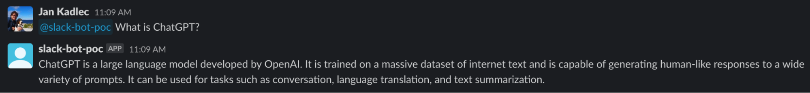
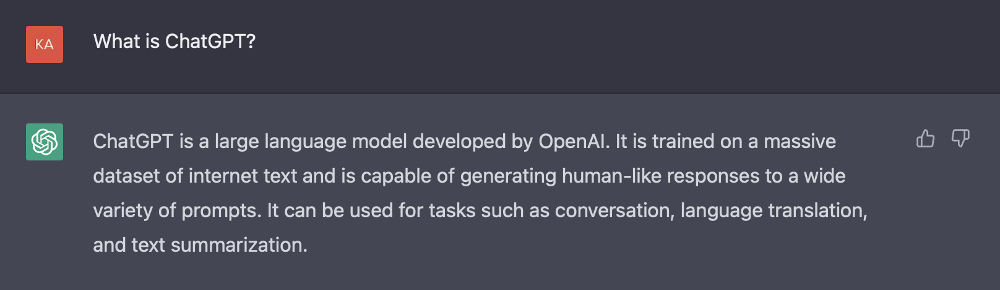
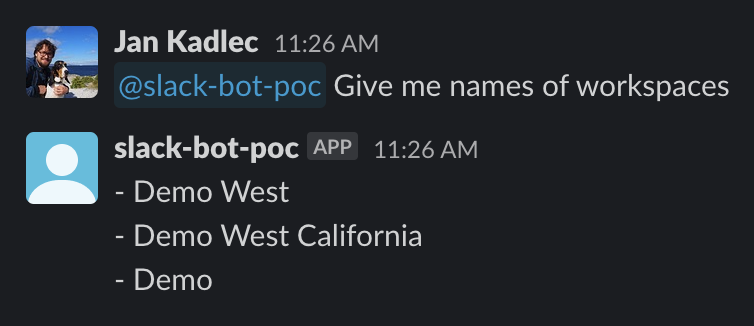
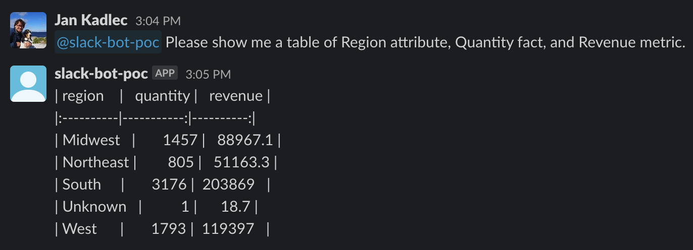

# GoodData + ChatGPT + Slack

In this demo, I would like to demonstrate the implementation of Slackbot based on [GoodData](https://gooddata.com/) enriched by [ChatGPT](https://openai.com/blog/chatgpt/).
The purpose of this demo is to show and motivate how the integration with ChatGPT can be done.
Even though, ChatGPT is not 100% percent ready for production and not even for integration.

**_Disclaimer:_** 
_This demo is only for research. Please do not use it in production, and beware of the licenses of used libraries._

Big thanks go to [Sergey Levchenko](https://github.com/siarhei-leuchanka), and [Jan Panský](https://github.com/janpansky) who worked with me on the base PoC for this demo.

## Pure integration of Slack with ChatGPT

You can find the pure integration of Slack with ChatGPT in the [pure_integration.py](use_cases/pure_integration.py) file.
The implementation is simple, and it takes the text sent to the Slackbot, passes the text to ChatGPT, and then the response is sent back to Slack by Slackbot.

Beware that you can use text formatting in Slack, such as **bold**, _italic_, `code`, etc. These changes will also be sent to ChatGPT.

## GoodData integration with ChatGPT

Unfortunately, at the time this demo was created, there were no ways to teach ChatGPT new things persistently.
Because of that, we need to do some hacks or, let's say, preprocessing of the information to teach ChatGPT something new.
Let's have a look.

### Use metadata to teach ChatGPT about GoodData

The use of metadata to teach ChatGPT about GoodData is presented in [metadata.py](use_cases/metadata.py).
The idea behind the implementation is to give ChatGPT information about GoodData first and then use the knowledge of ChatGPT.

> **Warning**
> ChatGPT input is limited. Please, consider the amount of metadata you will send.

### Use trivial endpoint to teach ChatGPT how things can be done

The last use case is to teach ChatGPT a request body for a simple API. We will use its knowledge to fill the request body in fact categorization.
Thanks to that we are able to call a method that gives us request data.

